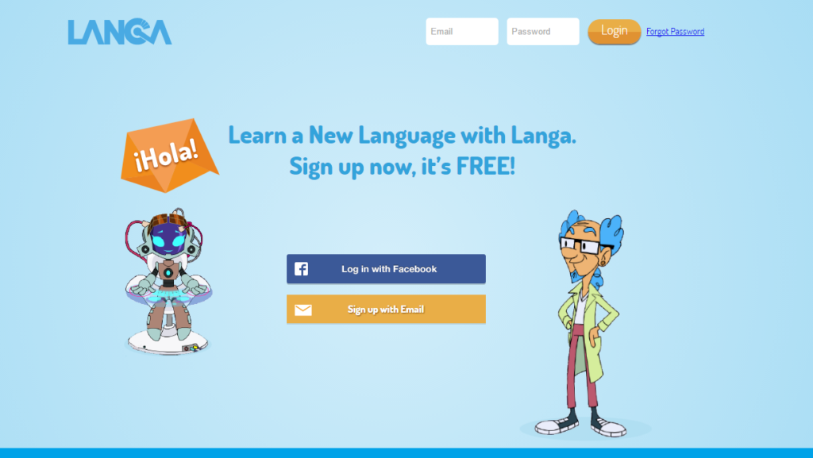

The titles below showcase my journey through the gaming industry and chronicle my experiences. Feel free to stick around and read what I’ve learned or check out some of the titles I’ve worked on in the past for yourself!

## NBA BALLER BEATS

<iframe width="560" height="315" src="https://www.youtube.com/embed/E_ifGC7Gvpw" title="YouTube video player" frameborder="0" allow="accelerometer; autoplay; clipboard-write; encrypted-media; gyroscope; picture-in-picture" allowfullscreen></iframe>

### XBOX 360 – HB STUDIOS – 2012

In Baller Beats you bounce a real ball to the beat of the music. Think Guitar Hero with a basketball. Kinect wasn’t supposed to detect objects, but we made it happen. The lag on the device was supposed to make it impossible to do a precise rhythm game, but we made it happen. Everyone else thought the game would turn out to be a joke, until we made the best product I’ve had the pleasure to be a part of. It’s existence is a constant reminder to me that dreams can be real if you never give up.

Check out Baller Beats [here](https://www.amazon.com/NBA-Baller-Beats-Xbox-360/dp/B007XUQXL0/ref=sr_1_1?ie=UTF8&qid=1484580137&sr=8-1&keywords=baller+beats)!

---

## KILL SHOT BRAVO

<iframe width="500" height="281" src="https://www.youtube.com/embed/VJzq-YIZsww" title="Kill Shot Bravo - Trailer - Download Now For FREE on Google Play!" frameborder="0" allow="accelerometer; autoplay; clipboard-write; encrypted-media; gyroscope; picture-in-picture" allowfullscreen></iframe>

### MOBILE – HOTHEAD GAMES – 2016
For Killshot Bravo I continued to perform Dev Ops duties, and was at one point transitioned to lay out and code the initial server side infrastructure for our multiplayer mode. This project exposed me to many networking problems I’d not considered before, such as NAT traversal, or how to queue and match players.

---

## KILL SHOT

<iframe width="500" height="281" src="https://www.youtube.com/embed/hhJBtvqpC_k" title="Official Kill Shot (by Hothead Games Inc.) iOS / Android Launch Trailer" frameborder="0" allow="accelerometer; autoplay; clipboard-write; encrypted-media; gyroscope; picture-in-picture" allowfullscreen></iframe>

### MOBILE – HOTHEAD GAMES – 2014
For Killshot I performed Dev Ops, creating and testing new server side features and API’s as designers needed. I also fixed bugs with old API’s and performed Client side integration to expose them in script for our front end developers use.

---

## LANGA LAB

### WEB – COPERNICUS STUDIOS – 2014
Langa is a series of apps and games developed in conjunction with Dalhousie University to teach second language skills to people of all ages, by utilizing speech recognition technology. They needed someone to build a CMS for their curriculum, an accompanying website and API for accessing the games and testing their efficacy.

Check out Langa Lab [here](https://www.langalab.com/)!

---

## MADDEN 13

### IOS/ANDROID – HB STUDIOS – 2013
This game was done as another co-development, with HB being given a few of the new modes to work on. I was responsible for adding the RPC hooks to Ultimate Team’s new Draft Duel mode. The flow of the mode involves two players choosing cards back and forth to build their team, then taking them into the game to play each other.

---

## MADDEN 12

<iframe width="500" height="281" src="https://www.youtube.com/embed/3mtnEFntquU" title="Madden NFL 12  - Trailer" frameborder="0" allow="accelerometer; autoplay; clipboard-write; encrypted-media; gyroscope; picture-in-picture" allowfullscreen></iframe>

### PS3/XBOX 360 – HB STUDIOS – 2012
This is the first co-development that I’ve worked on. This means EA Tiburon gave us some features to develop with them. Since this was one of the first times they’d done this with us there were several challenges that came up at first, mostly around communication. Once those were sorted out things worked quite well and went smoothly for the rest of development.

---

## FIFA 11

<iframe width="500" height="281" src="https://www.youtube.com/embed/WLi2sSNeXnY" title="FIFA 2011 Official Trailer HD" frameborder="0" allow="accelerometer; autoplay; clipboard-write; encrypted-media; gyroscope; picture-in-picture" allowfullscreen></iframe>

### PS2 – HB STUDIOS – 2011
This iteration had a much more casual development cycle than 10, smaller team size, and a smaller scope. In truth we got a lot done because of the amount of seasoned FIFA developers on the team from the previous year, even with fewer developers overall. I’m now convinced that keeping that knowledge base around is vital to a smooth project.

---

## FIFA 10

<iframe width="500" height="281" src="https://www.youtube.com/embed/Tky31XLrnls" title="FIFA 10 - Official Trailer - HD!" frameborder="0" allow="accelerometer; autoplay; clipboard-write; encrypted-media; gyroscope; picture-in-picture" allowfullscreen></iframe>

### PS2/PC – HB STUDIOS – 2010
This is the all hands on deck project. Three skus, a world cup year, and I’m sure falling on a multiple of 10 has some additional meaning and pressure that was possibly subconscious. At the same time I feel I learned the most about game development during this project.

---

## NHL 09

<iframe width="500" height="281" src="https://www.youtube.com/embed/mzUuQG2b0lU" title="NHL 09 EA Sports Hockey League Trailer" frameborder="0" allow="accelerometer; autoplay; clipboard-write; encrypted-media; gyroscope; picture-in-picture" allowfullscreen></iframe>

### PS2/PC – HB STUDIOS – 2009
This was my first professional software project and game. It taught the tools that we never knew existed in college but are vital for day to day development. Sometimes a piece of work comes around to make me feel that sense of excitement again.
